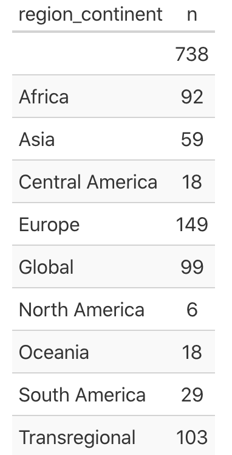

```{r setup, include=FALSE}
knitr::opts_chunk$set(echo = TRUE)
library(rio)
library(here)
library(tidyverse)
library(ggplot2)
library(gghighlight)
library(colorblindr)
library(gt)
iea <- import(here("data", "iea_measonly.dta"))
```

```{r subject_plot, fig.width = 6, fig.height = 4}
iea %>%
  # mutate(subject_group = fct_reorder(subject_group, )) %>% 
  ggplot(aes(subject_group, fill = subject_group)) +
           geom_bar(position = "dodge") +
  facet_wrap(~agreement_type) +
  coord_flip() +
  guides(fill = FALSE) +
  labs(
    x = "Type of treaty group",
    y = "Number of treaties",
    title = "Type of environmental treaties by subjects"
  )
```
  
  Thuy, in the plot below, if you do a count on region_continent, you get a tibble: 10 x 2 showing the first region_continent name is blank and has an n size = 738, a larger n size than all other rigion_continents combined. Perhaps you could drop the blank name and that would help make the output meaninful?  
  \floatbarrier

  
```{r continent_plot, fig.width = 6, fig.height = 8}
iea %>%
  select("tsig_yr",
         "subject_group",
         "region_continent") %>%
  arrange(tsig_yr) %>%
  group_by(subject_group, region_continent, tsig_yr) %>%
  ggplot(aes(region_continent, fill = subject_group)) +
  geom_bar(position = "dodge") +
  coord_flip() +
  guides(fill = FALSE) +
  facet_wrap(~region_continent, nrow = 5) + # something went wrong with the first graph
  labs(
    x = "Type of treaty group",
    y = "Number of treaties",
    title = "Type of environmental treaties by continent"
  )
```

# From signature to entry into force
```{r timegap_plot, fig.width = 6, fig.height = 4}
dp3 <- iea %>%
  select("subject_group",
         "tsig_yr",
         "teif_yr") %>%
  mutate(into_force = teif_yr - tsig_yr) %>%
  filter(into_force < 20)
  # group_by(into_force) 
  # mutate(subject_group = fct_reorder(subject_group, into_force)) %>%

ggplot(dp3, aes(fct_reorder(subject_group, into_force), into_force)) + # why fct_reorder doesn't work here?
  geom_col(position = "dodge") + # not sure what the dodge does here. I just got weird result without dodge. 
  coord_flip() +
  scale_fill_viridis_d() +
  labs(
    y = "Number of years from signature to entry into force",
    x = "Type of treaty group",
    title = "Time gap (in year) between signature and entry into force of environmental treaties "
  )
```